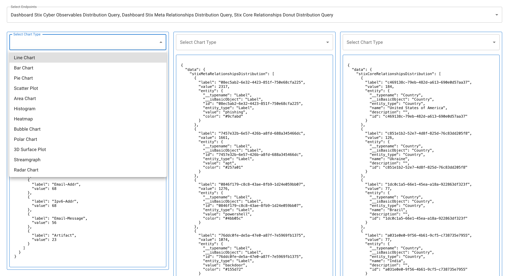

### Sandbox to stylize Charts and Graphs based on our GraphQL endpoints

Use D3.js / Three.js to render each Graph Type available to each [endpoint](https://github.com/eliataylor/cosmo-charts/blob/master/src/index.tsx#L12):

The goal is match this dashboard style guide graphic:

Consolidate your code with utility functions to construct the graph config values and style sheets dynamically

